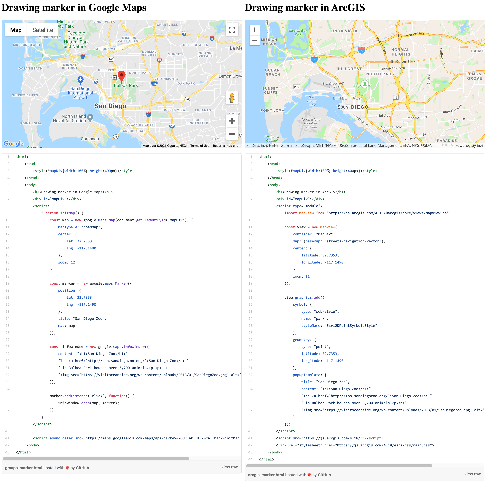
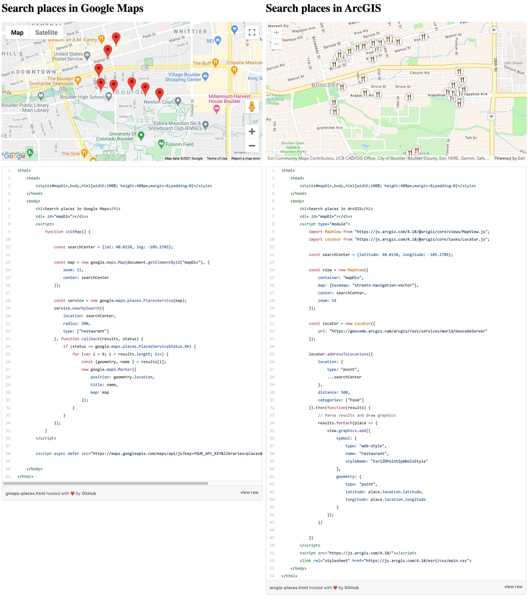

# Code samples: Google Map <> ArcGIS

This is a collection of samples showing how to do the same things with [Google Maps JavaScript API](https://developers.google.com/maps/documentation/javascript/overview) and [ArcGIS API for JavaScript](https://developers.arcgis.com/javascript/latest/)

## [Draw a marker](https://esri-es.github.io/gmaps-arcgis/marker/marker.html)

## [Search for places](https://esri-es.github.io/gmaps-arcgis/places/places.html)

## Missing samples

Feel free to request more samples using the [issues of this repo](https://github.com/esri-es/gmaps-arcgis/issues).

## Configure

If you want to configure this in your local machine please rename the config_sample.js to config.js and add your API keys.
